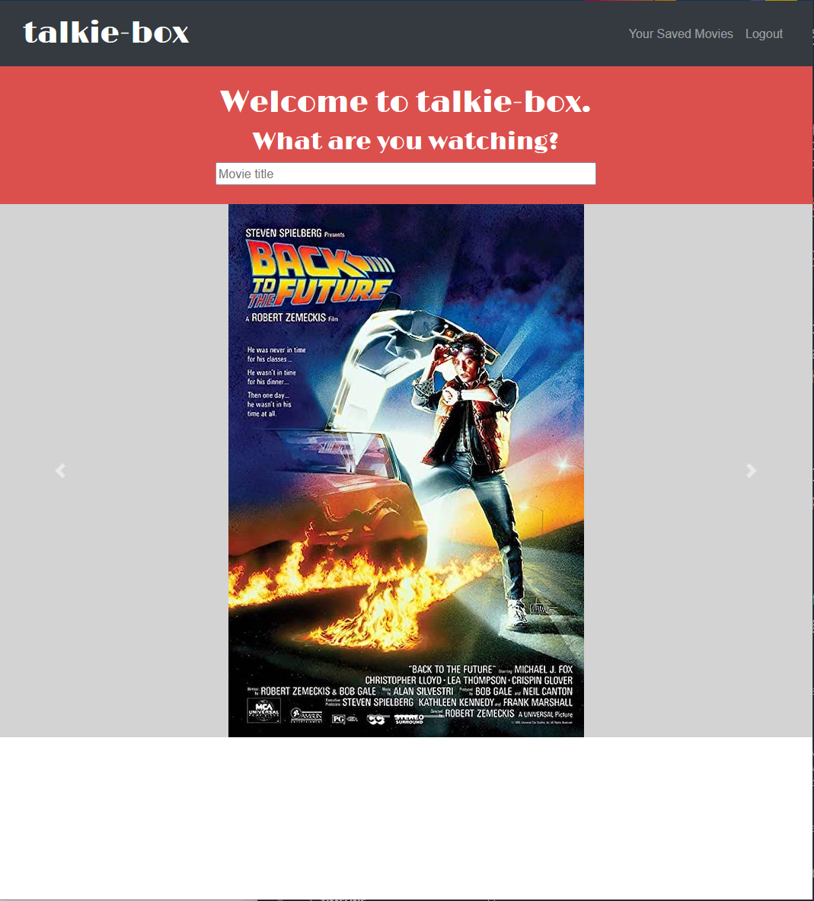

# talkie-box

  ## Licensing:
  

  ## Table of Contents
  - [Description](#description)
  - [Installation](#installation)
  - [Usage](#usage)
  - [Contribution](#contribution)
  - [Testing](#testing)
  - [Additional Info](#additional-info)

  ## Description:
  talkie-box is a web application that lets movie fans from all over to search and save their favorite movies, as well as discuss with others what they do and do not like about their movies.
   
  

  ## Installation:
  Once the code has been cloned, be sure to run 'npm i' in the root folder for the packages in all folders to be installed.

  ## Usage:
  This application allows for the searching, saving, deleteing, and discussing saved movies in your profile.

  ## License:
  MIT

  ## Contribution:
  Juan Pablo Marin, Elizabeth Beltz, Michael Smith, Wyatt Castellan

  ## Testing:
  Not applicable.

  ## Additional Info:
  - Github: [wcastellan](https://github.com/wcastellan)
  - Email: wcastellan@yahoo.com 